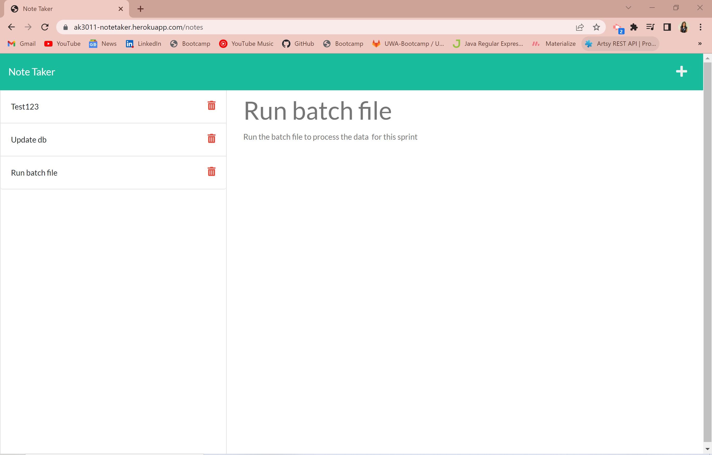
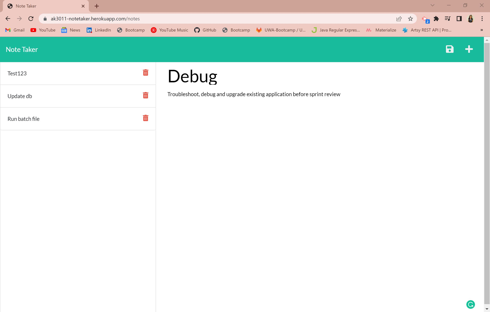

# NoteTaker

## Overview
Application that can be used to write and save notes. 

## Description
This application will help the user to create and save notes for the busy schedule. This application uses an Express.js back end and will save and retrieve note data from a JSON file. 

## Table of Contents
  
1. [Installation](#installation)
2. [Usage](#usage)
3. [Licenses](#licenses)
4. [Contributing](#contributing)
5. [Tests](#tests)
6. [Questions](#questions)
  
  ## Installation
  To install various dependencies, run the following command:

  ` 
  npm install 
  ` 

  ## Usage
  User can access this application [here](https://ak3011-notetaker.herokuapp.com/notes). 
  
  Here are some working snippets of the application:
  
  

  ## Licenses
    This project uses the Apache License 2.0 license. More info about licenses can be found [here](https://opensource.org/licenses/Apache-2.0)

  ## Contributing
  This project is open for contribution but please initiate an issue for any significant changes. [Contributor Covenant](https://www.contributor-covenant.org/)
  
  ## Tests
  To run tests, run the following command: 
  ` 
  npm test
  ` 
  
  ## Questions
  The developer can be reached through [Email](akshata.kumbhar@hotmail.com) or contacted through 
  [Github](https://github.com/akshu3011).